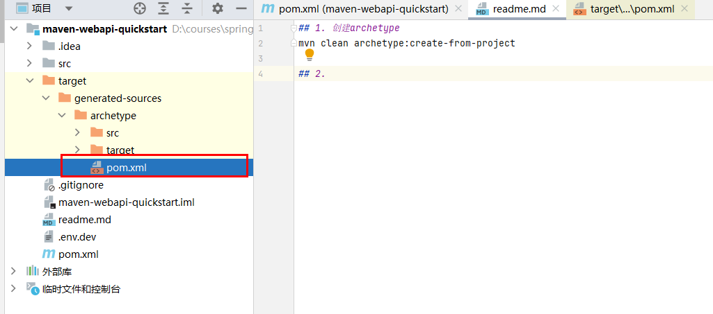
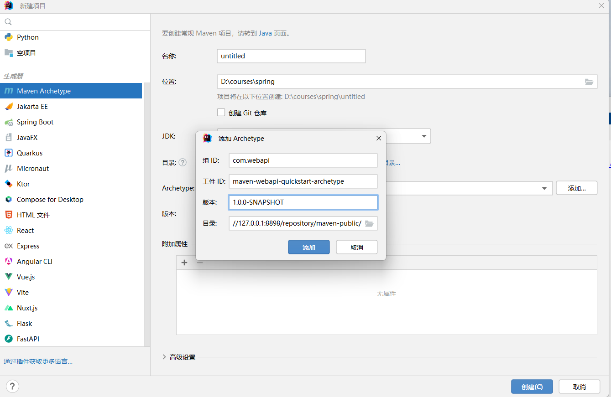

## 1. 创建archetype
```bash
mvn clean archetype:create-from-project
```

## 2. 到生成的target目录下找到pom.xml


## 3.向其中加入如下配置
```xml
<distributionManagement>
    <repository>
      <id>nexus-releases</id>
      <name>Nexus Release Repository</name>
      <url>http://127.0.0.1:8898/repository/maven-releases</url>
    </repository>
    <snapshotRepository>
      <id>nexus-snapshots</id>
      <name>Nexus Snapshots Repository</name>
      <url>http://127.0.0.1:8898/repository/maven-snapshots</url>
    </snapshotRepository>
  </distributionManagement>
```

## 4.发布archetype到nexus
```bash
mvn install
mvn archetype:crawl
mvn deploy
```

## 5.maven的全局配置文件settings.xml需要如下配置
```xml
<?xml version="1.0" encoding="UTF-8"?>

<settings xmlns="http://maven.apache.org/SETTINGS/1.2.0"
          xmlns:xsi="http://www.w3.org/2001/XMLSchema-instance"
          xsi:schemaLocation="http://maven.apache.org/SETTINGS/1.2.0 https://maven.apache.org/xsd/settings-1.2.0.xsd">
  <pluginGroups>

  </pluginGroups>
    
  <proxies>

  </proxies>
    
  <servers>
    <server>
        <id>nexus</id>
        <username>admin</username>
        <password>123456</password>
    </server>
    <server>
       <id>nexus-snapshots</id>
       <username>admin</username>
       <password>123456</password>
     </server>
     <server>
       <id>nexus-releases</id>
       <username>admin</username>
       <password>123456</password>
     </server>

  </servers>

  <mirrors>
    <mirror>
      <id>maven-default-http-blocker</id>
      <mirrorOf>external:http:*</mirrorOf>
      <name>Pseudo repository to mirror external repositories initially using HTTP.</name>
      <url>http://0.0.0.0/</url>
      <blocked>false</blocked>
    </mirror>
  </mirrors>

  <profiles>

    <profile>
        <id>default-profile</id>
        <properties>
            <project.build.sourceEncoding>UTF-8</project.build.sourceEncoding>
            <project.reporting.outputEncoding>UTF-8</project.reporting.outputEncoding>
        </properties>
    </profile>

      <profile>
          <id>nexus</id>
          <repositories>
              <repository>
                  <id>releases</id>
                  <url>http://127.0.0.1:8898/repository/maven-releases/</url>
                  <releases>
                      <enabled>true</enabled>
                  </releases>
                  <snapshots>
                      <enabled>false</enabled>
                  </snapshots>
              </repository>
              <repository>
                  <id>snapshots</id>
                  <url>http://127.0.0.1:8898/repository/maven-snapshots/</url>
                  <releases>
                      <enabled>false</enabled>
                  </releases>
                  <snapshots>
                      <enabled>true</enabled>
                  </snapshots>
              </repository>
          </repositories>
      </profile>
      
  </profiles>
    
  <activeProfiles>
      <activeProfile>default-profile</activeProfile>
      <activeProfile>nexus</activeProfile>
  </activeProfiles>
</settings>
```
## 6.使用IDEA根据nexus的archetype创建项目

